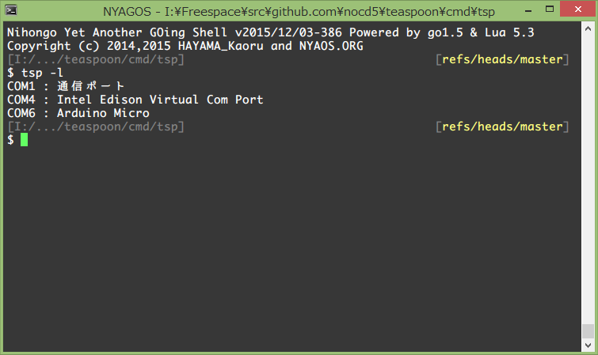
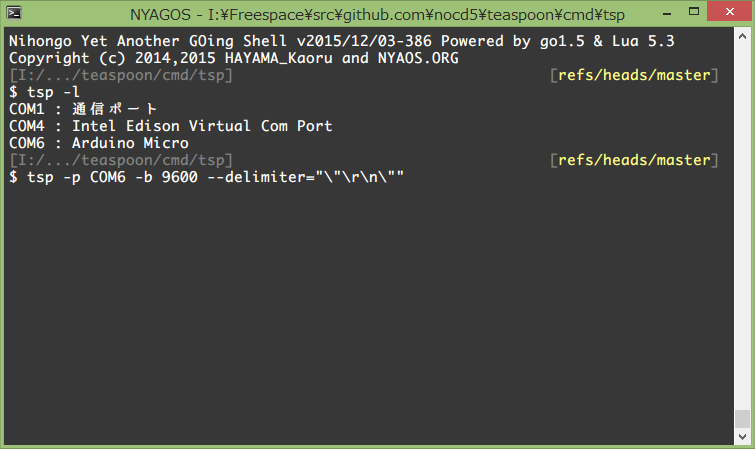
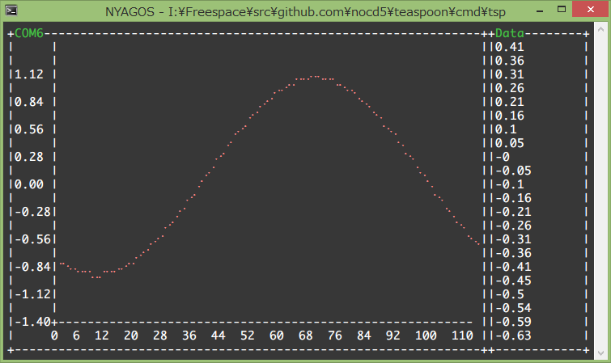

# teaspoon
Terminal Serial Plotter

## List COM Ports

```sh
tsp -l
```



## Connect

```sh
tsp -p COM6 -b 9600
```



A Delimiter option `--delimiter="\"\r\n\""` may be needed if you use Serial.println in Arduino.  
Because Serial.println terminate string by **CRLF**

### Arduino side sample code
```ino
void setup() {
    Serial.begin(9600);
}

int x = 0;
void loop() {
    Serial.println(sin(x/180.0 * M_PI));
    x = (x + 3) % 360;
    delay(100);
}
```

## Run



## Quit

Press `Q` key to quit
